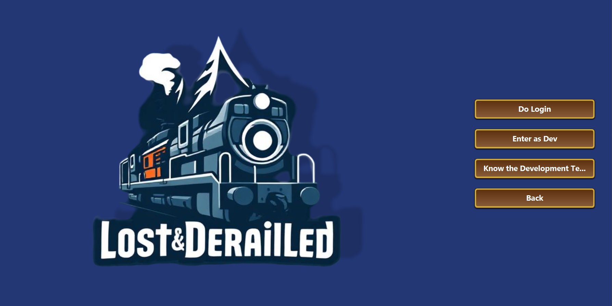

# USER MANUAL

## -- COVER

## Table of contents
> **Introduction**
> 
> **System/Program Overview**
> >
> >EDITOR & PLAYER
> >
> >EDITOR 
> >
> >PLAYER
> 
> **System/Program Requirements**
> 
> **Features**
> 
> **Troubleshooting and Helpdesk**
> 
> **FAQ**

## [Glossary](docs/system-documentation/global-artifacts/01.requirements-engineering/glossary.md) 

## Introduction
> This user manual is designed to guide you through the functionality and usability of our application, which consists
> of two main tools: the Map and Scenario Editor and the Simulator.
> 
> As an editor, you can interact with the Map and Scenario Editor while as a player, you can use the Simulator.
> 
> The Map and Scenario editor allows you to create and customize maps and scenarios. As for the Simulator, it enables
> you to play the different scenarios.
> 
> When playing a simulation, you can create your own Railway Network the way you desire.
> 
> Throughout this manual you'll have a step-by-step explanation of how to use the various functionalities of
> each tool

## System/Program Overview

### EDITOR & PLAYER
> **Authentication:** After opening the application, editors and players must authenticate to be able to proceed further.
> If you don't have login credentials, you can register, creating your own account where you'll have to specify if you
> will perform as an editor or as a player.

### EDITOR
> ### Create a new map:
> 
>  To create a new map, you have to choose the option '1. Create a new Map'

> ### Create a new Scenario:
> 
> To create a new scenario, you have to choose the option '2. Create a new Scenario', a sequence of steps will be presented to you, and you must follow them to create a scenario successfully.
>
>> **Define map and period:**
>> 
>> First, you will need to choose a map to create a scenario in, choose the period you want the scenario to take place and click confirm.
>
>>**Defining exports and transformations in mixed industries:**
>>
>>If there are mixed industries on the map, you will be asked to define their imports and exports, a list of every cargo in the game, except passengers and mail will appear, and you will have to select the cargo that the mixed industry will import and export.
>You'll also be asked to define transforming industries, where you'll have to choose which ones you want to operate in the mixed ones.
>
>> **Defining the production rate factor of generating industries**
>
>> You will be able to choose the factor that changes the production rate of primary industries, the most important industries in the game.
>> Primary industries have a base production rate of 12 cargoes per year, you are able to change that by a percentage, for example, if you define a factor of 100, the industry will produce 100% more (24 cargoes per year).
>
> > **Restriction of locomotive types**
>> 
> > At this point, you can define which types of locomotives will be available to buy in the game (Steam, Diesel, Electric).
> > If you decide to not restrict locomotive types, every locomotive will be available to be brought in the game.
>
> >**Change locomotive availability period**
>>
> >This step allows you to change the period each locomotive will be available to be purchased, most locomotive has a year to enter and leave the market (some don't have year to leave the market).
> >The locomotives you can change the period are already filtered by the types you choose to be available in the scenario, you can change both years, entry and exit.
>
> >**Create a historical Event**
> >
> >To finalize the creation of a scenario, you can create an event that will appear in the beginning of the simulation, here you can write an explanation of the scenario, the events that occur to give the player information about why the elements of this scenario are defined this way.
>
> >**Save the Scenario**
>>
> >In addition, you have the option of saving the scenario you've created so that you can use it again after logging out.

> ### Add a new Industry:
> 
> >To add a new industry, you have to choose the option '5. Add a new Industry'
> 
>> **Map Selection** 
>> 
>> A numbered list of available maps will be shown. You must choose the number corresponding to the map where you want to add the industry. 
>> If no maps are available, a message will inform you that a map must be created first, and the process will end.
>
>> **Choose Industry Type**
>> 
>> After selecting a map, choose the type of industry to add using the following numbered options:
>> 1. Primary Industry
>> 2. Transforming Industry
>> 3. Mixed Industry
>> 4. Cancel
>>
>> If you choose "Cancel", you will return to the previous menu without making any changes.
>
>> **Choose Specific Industry (if applicable)**
>> 
>> If you chose Primary or Transforming Industry, a numbered list of available industries of that type will be shown.
>> You must select the desired industry by entering the corresponding number.
>> If the number is out of range or invalid, you will be asked to try again.
>> For Mixed Industries, this step is skipped.
>
>> **Define Map Position**
>> 
>> You must enter the X and Y coordinates where you want to place the industry.
>> The coordinates must be valid integers within the boundaries of the map.
>> The system checks if the position is available (not occupied by another structure or industry).
>> If the position is invalid, you will be asked to enter new coordinates.
> 
>> **Industry Addition Confirmation** 
>>
>> If the position is valid, the industry will be successfully added to the map.
>> A confirmation message will appear, for example,
>> "Primary industry added successfully."
> 
>> **Add Another Industry**
>>
>> After the addition, you will be asked:
>> "Do you want to add another industry? (y/n):"
>> Type y to repeat the process.
>> Type n to return to the main menu.
>> Invalid answers will prompt you again.

> ### Create a new City: 
> 
> > **Create a new City:** To create a new city, you have to choose the option '6. Create a new City'
>
>> **Map Selection**
>>
>> A numbered list of available maps will be shown. You must choose the number corresponding to the map where you want to create a new city.
>> If no maps are available, a message will inform you that a map must be created first, and the process will end.
>
>> **Enter City Name and Position**
>>
>> You'll be asked to enter the name of the city.
>> The system checks if the name is valid and whether it already exists on the selected map.
>> If the name already exists, you'll be asked whether you want to keep it (in which case the prefix "new " will be added) or try another name.
>> Next, you'll input the coordinates (X and Y) where the city will be located.
>> The system validates whether the coordinates:
>> Are within the map's boundaries.
>> Do not overlap existing structures (overbuilding prevention).
> 
>> **Confirm City Creation**
>> 
>> A summary of the data will be shown:
>> City name
>> Coordinates
>> You will be asked to confirm:
>> 1. Confirm → The city is created.
>> 2. Cancel → The process restarts from the beginning. 
>
>> **Define House Blocks**
>> 
>> You'll be asked to input the number of house blocks to include in the city.
>> The system will:
>> Validate that the number is positive.
>> Ensure there is enough space on the map for the requested number of blocks.
>> If the number is valid and greater than 0, proceed to the next step. 
> 
>> **Choose Insertion Method**
>>
>> You will choose how to insert the house blocks:
>> 1. Manual – You provide the coordinates for each block.
>> 2. Random – Blocks are automatically placed in valid positions.
>> 0. Back– Returns to the menu.
>>
>> If you choose manual insertion, you'll be asked to input coordinates for each block:
>> The system validates each position (valid input, not overlapping, within bounds).
>> You’ll be notified whether each block was inserted successfully or needs re-entry.
>> If you choose random insertion, blocks are placed automatically, and you’re notified upon completion. 
>
>> **Final Confirmation**
>> At the end, you’ll be asked:
>> Do you want to create another city? (y/n):
>> 
>> - y → The process repeats from the beginning.
>> - n → You return to the main menu.

### PLAYER

> ### Create a Simulation:
> 
> > Before you start playing a simulation, you need to create it. Some parameters are necessary to play a simulation.
> >
>>Then, select the "Play a Simulation" option, select the "Create a Simulation" option, here you define a name for the simulation (the name under which the simulation will be saved) and choose the difficulty.
> >
>>You have 3 difficulty options, where what varies is the budget with which you start the simulation, you can choose the standard budget, or you can choose one of the other budgets that will make the game easier for you.

> ### Play a Simulation:
> 
> > This option allows you to start a simulation.
> > After you have created it, select "Play a Simulation" and then select the simulation you want to play (you can create more than one simulation), then the simulation starts running, at first there will be no events, as there are no stations, railway lines or trains, it's up to you to create what you want.

> ### Load a Saved Simulation: 
> 
> > If you have already played a simulation and saved it, you can continue playing it from the point where you saved, to do this select the “Load a Saved Simulation” option and choose the one you want to continue playing, when you select “Play a Simulation”, the simulation you downloaded will appear for you to select.

> ### Simulation Running:
> 
> > While the simulation is running, the only interaction you can have with the simulation is to pause, speed up or slow down, and zoom in and out other types of interactions 
>are only available with the simulation in pause.
>   
> > Here, you can see the current date of the simulation, you budget and its movements, the map size, logs of the simulation, like cargoes produced, 
> cargoes picked up, cargoes delivered, new locomotives available to purchase, train arrivals, among others.
> 
> > On the right side of your screen, you will see the various trains you have put on a route, you can see their status, current cargoes being transported and the station they are currently travelling to.
> 
> > The railways are displayed in different colors, depending on the type, red for simple lines, where electric locomotives can't travel, and yellow for electric lines
> 
> > The ID of the trains will be displayed above the train, so you know what train you are looking at.
> 
> > You can also click "SHIFT" to see the names of the stations, it is useful to use when you are zoomed out and you can't see the names of the stations.

> ### Simulation Paused
>> ### Buy a locomotive:
>> You can buy locomotives to later create trains and routes, to do this, while the game is paused, select the Buy a locomotive option, here you will be presented with a menu showing the various locomotives available in the scenario on the current date of the game, along with their price. 
>> 
>> When you select the locomotive you want to buy, its features (top speed, maintenance cost, reliability, fuel cost, acceleration, type) will be presented to you, to complete the purchase process, you must confirm the purchase, otherwise, if you change your mind, you can cancel the purchase, returning to the locomotive menu.
>> 
>>If you decide that you don't want to buy a locomotive after all, select the “Back to menu” option, which will take you back to the pause menu.
>> 
>> ### List All Trains:
>>  
>> You can check the details of all trains in the simulation by simply selecting the List all trains option. The trains will be displayed organized by locomotive type and name alphabetically.
>> If there are no trains available, the system displays a message, such as:
>>
>> No Trains found.
> 
>> ### Build a new Railway Line:
> > To build a new railway line, you have to select the "Build a new Railway Line" option, here you will be asked to choose the type of railway line you want to build, either simple or electric, the stations you want to
> connect, and the length for the line (optional).
> After the process, a new line will appear on the map, connecting the stations you selected.
> This will have a cost, which will be deducted from your budget, and displayed on the left side of the screen, in the game logs.
> 
> >  ### Assign train to a new route:
> > This is the longest process in the game, but it is also the most important, as it allows you to create routes for your trains to follow.
> To assign a train to a route you may select the option "Assign train to a new route", here you will be asked to create a train,
> where you have to choose a locomotive to construct the train, then you have to select the train you want to assign to the route, with that done, 
> you may select "Route menu" to create the route.
> >
> > In this menu you can choose the stations you want the train to stop at in the option "Choose Next Station", and the carriages you want to add to the train at each station (this option should be selected for each station you include in the route).
> You are able to see the complete route before create it selecting "Show route", where the stoppages and the cargo picked up at each stoppage will be displayed.
> >
> >You can also select in the option "Cargo Mode" if you want the train to depart only when it is full, half full, or depart regardless of the amount of cargo it has (this option should be selected for each station you include in the route).
> After making sure that the route is correct, you can select "Confirm Route (Finalize)", which will create the route and assign it to the train.
> >
> > Then you press resume to start the simulation, and the train will start following the route you created.
> 
> > ### Buy a locomotive:
> > You can buy locomotives to later create trains and routes, to do this, while the game is paused, select the Buy a locomotive option, here you will be presented with a menu showing the various locomotives available in the scenario on the current date of the game, along with their price. 
> > 
> > When you select the locomotive you want to buy, its features (top speed, maintenance cost, reliability, fuel cost, acceleration, type) will be presented to you, to complete the purchase process, you must confirm the purchase, otherwise, if you change your mind, you can cancel the purchase, returning to the locomotive menu.
> > 
> >If you decide that you don't want to buy a locomotive after all, select the “Back to menu” option, which will take you back to the pause menu.
>
> > ### Buy/Upgrade a Station:
> > This option allows you to create a new station or upgrade an existing one.
> >
> > #### Create a new Station:
> > To create a new station, you have to select the "Add Station" option, here you will be asked to choose the type of station (Terminal,Default station,Depot), the position (X and Y coordinates) where you want to place the station, and the name of the station.
> >
> > For the name, you can choose a name, or you can select the name of the closest city, and the station will be named after that city.
> >
> >#### Upgrade an existing Station:
> > To upgrade an existing station, you have to select the "Upgrade Station" option, here you will be asked to choose the station you want to upgrade, the station will upgrade to the next level (depot to default station, default station to terminal).
> > Obviously, you can't upgrade a terminal as it has the higher level.
> 
> > ### Add Building to a Station:
> > This option allows you to add a building to a station, which will increase the profitability of the station.
> > There are 11 types of buildings (post office, liquid storage, silo, hotel, cafe, customs, telephone, telegraph, small restaurant, large restaurant, salon),
> > each building has its own characteristics and will increase the profitability of the station in different quantities.
> > 
> > You can add 1 type of each building to each station.
> 
>> ### Show Financial Results:
> > This option allows you to see the financial results of your simulation, such as cargo revenue, maintenance costs, for the railway lines and trains, and the expenses on fuel for the trains.
> The financial results are presented in a dropdown format, you have to select the option you want to see (cargo revenue, train maintenance expenses, train fuel expenses, railway maintenance expenses) and the yearly results will be displayed.
> 
>> ### Save a Simulation:
>> If you want to save your simulation, you can do so by selecting the "Save a Simulation" option, here you will save the simulation, and you will be able to continue playing it later.
>
> > ## Exit Simulation:
> > If you want to exit the simulation, you can do so by selecting the "Exit Simulation" option, this will take you back to the main menu of the application.

## System/Program Requirements
> The application is designed to run on any operating systems, including Windows, macOS, and Linux.
> 
> There are no specific hardware requirements, as the application is lightweight and can run on most modern computers. Of course, the performance of the application may vary depending on the specifications of your computer.

## Features
> The application is designed to be user-friendly and intuitive, allowing users to easily navigate through the various functionalities.
> 
> The Map and Scenario Editor provides a comprehensive set of tools for creating and customizing maps and scenarios, while the Simulator offers an engaging and interactive experience for players.
> 
> The application is built with a focus on performance and scalability, ensuring that it can handle large and complex maps and scenarios without compromising on speed or responsiveness.
> 
> The application has an authentication system that allows users to create accounts and log in securely. The password needs to have seven alphanumeric characters, including three capital letters and two digits
> 
> Maps, scenarios, and simulations can be saved and loaded, allowing users to continue their work or gameplay at a later time.
> 
> The simulation has various features, a pause and start bottom, two bottoms to accelerate and decelerate the simulation, and a friendly user layout.

## Troubleshooting and Helpdesk
> If you encounter any issues while using the application, please refer to the troubleshooting section of this manual for guidance.
> 
> We also have a helpdesk available to assist you with any technical problems or questions you may have.
> 
> We desire to provide a seamless user experience, and our support team is always ready to help you resolve any issues you may encounter.

## FAQ
> **Q: What's the perfect size for the map?**
> 
> **A:** The perfect size for the map is 150x150. This size ensures that the map is large enough to accommodate various features and elements without becoming too complex or difficult to navigate.
> 
> **Q: What's the period with the most locomotives available?**
> 
> **A:** The period with the most locomotives available is between 1850 and 1950. During this time, a wide range of locomotives were produced, providing players with numerous options to choose from, which makes this period a good period for the scenario.
> 
> **Q: How many locomotives can I buy?**
> 
> **A:** You can buy as many locomotives as you want, as long as you have the budget to do so. There is no limit to the number of locomotives you can purchase in the game.
> 
> **Q: How many trains can I create?**
> 
> **A:** You can create as many trains as you want, as long as you have the locomotives to do so. There is no limit to the number of trains you can create in the game.
> 
> **Q: How many types of railway lines and trains there are in the game?**
> 
> **A:** There are 2 types of railway lines: Simple and Electric. As for the trains, there are 3 types of locomotives: Steam, Diesel, and Electric. Each type of locomotive has its own characteristics and can be used in different scenarios.
> 
> **Q: In which railway lines can the different types of locomotives travel?**
> 
> **A:** There are 3 types of locomotives: Steam, Diesel, and Electric. Steam and Diesel locomotives can travel in any type of railway line (simple or electric), while Electric locomotives can only travel in electric railway lines.
> 
> **Q: How many railway lines can I create?**
> 
> **A:** You can create as many railway lines as you want, as long as you have the budget to do so. There is no limit to the number of railway lines you can create in the game.
> 
> **Q: How many stations can I create?**
> 
> **A :** You can create as many stations as you want, as long as you have the budget to do so. There is no limit to the number of stations you can create in the game.
> 
> **Q: How many types of stations are there in the game?**
> 
> **A:** There are 3 types of stations: Terminal, Station and Depot, the only difference between them are the area they cover and the cost.
> 
> **Q: How many types of cargo are there in the game?**
> 
> **A:** There are many types of cargoes in the game, including passengers, mail, coal, iron ore, wood, grain, and more. Each type of cargo has its own characteristics and needs to be transported in different carriages.
> Every cargo is disposed in the surrounding stations of the industry or house block by carriage, that means, industries and house blocks produce cargoes when they have enough cargo produced to fill a carriage,
> except for passengers, passengers don't need to fill a carriage to be transported.
> 
> **Q: Can I create a Scenario in any date?**
> 
> **A:** Basically you can create a scenario with any period, but you can't choose a date before year 0, and if you create scenarios with periods after 2020,
> there will be almost no locomotives available, so if you choose a period after 2020, you should change the locomotive availability period to include more locomotives.
> 
> **Q: Can I create a Scenario with any map?**
> 
> **A:** Yes, you can create a scenario with any map, as long as the map is compatible with the game. The map should be large enough to accommodate various features and elements, and it should be designed to provide an engaging and interactive experience for players.
> 
> **Q: How many cargoes can I transport in a train?**
> 
> **A:** Trains can carry up to 8 carriages of cargo from one station to another, when it arrives at the next station, all the cargo is unloaded, cargo that is not demanded is left and the player 
> receives 0 revenue for it, then there you can choose another 8 carriages of cargo to transport, and so on.
> 
> **Q: How many carriages can I buy?**
> 
> **A:** You don't need to buy carriages, carriages are available at each stations for free, you can only choose carriages from the same type as the cargo supplied in the station.
> 
> **Q: How many types of carriages are there in the game?**
> 
> **A:** There are as many types as cargoes, since each type of cargo has its own carriage.
> 
> **Q: Tips for creating a good scenario?**
> 
> **A:** When creating a scenario, make sure you have a good balance of industries and house blocks, since industries produce cargoes and transform it in final cargo and house blocks are the elements of the game that consume final cargo, so you want to make
> sure that you have enough industries to supply the house blocks with cargoes, and enough house blocks to consume the final cargoes produced by the industries.
> 
> **Q: How does the cargo production work?**
> 
> **A:** The cargo production works by the industries producing cargoes based on the production rate factor defined in the scenario, which is a percentage that increases or decreases the base production rate of 8 cargoes per year.
Industries produce cargoes by carriage, meaning they only produce 1 carriage of cargo, while passengers produced by house blocks can be piked up even if it doesn't fill a carriage. The money you will earn for it will be proportional to the amount of cargoes you transport, so the more cargoes you transport, the more money you will earn.
> 

